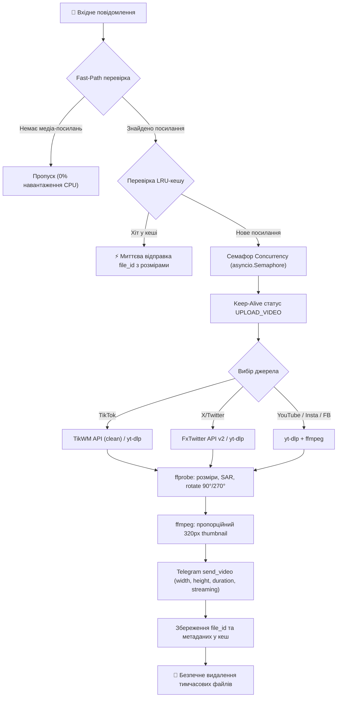
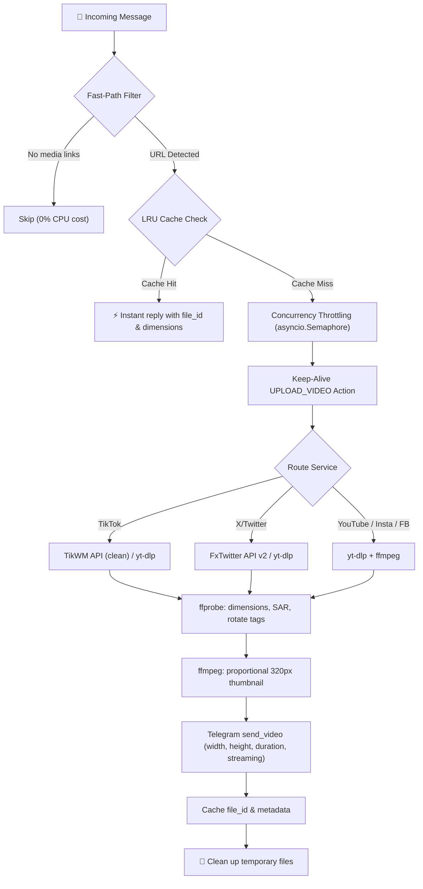

<div align="center">


# ⚡ Relay

**High-Performance Asynchronous Media Interceptor & Downloader for Telegram**  
*Високопродуктивний асинхронний бот для перехоплення та завантаження медіа без втрати якості та звуку*

[](https://github.com/vbazavliuk/Relay/actions/workflows/ci.yml)
[](https://www.python.org/)
[](https://docs.aiogram.dev/)
[](https://www.docker.com/)
[](https://github.com/yt-dlp/yt-dlp)
[](https://ffmpeg.org/)
[](https://opensource.org/licenses/MIT)
[](https://github.com/astral-sh/ruff)

---

### 🌐 Select Language / Оберіть мову
[**🇺🇦 Українська**](#-українська) &nbsp;|&nbsp; [**🇬🇧 English**](#-english)

---

</div>

<br/>

<a id="-українська"></a>
## 🇺🇦 Українська

**Relay** — це сучасний, мінімалістичний та високопродуктивний Telegram-бот для автоматичного перехоплення посилань і миттєвого завантаження відео в чат безпосередньо з **YouTube (Shorts / Reels / Відео)**, **TikTok**, **Instagram**, **X (Twitter)** та **Facebook**.

Проект створено з особливим акцентом на **збереження оригінальних пропорцій відео** (вирішення проблеми «квадратних» та сплюснутих роликів у Telegram) та **100% гарантію наявності звуку**.

---

### 🚀 Підтримувані платформи та можливості

| Платформа | Підтримувані формати | Особливості |
| :--- | :--- | :--- |
| **▶️ YouTube** | `shorts/...`, `youtu.be/...`, `watch?v=...` | До 1080p, об'єднання потоків (відео + аудіо в MP4), фільтр трансляцій `!is_live` |
| **🎵 TikTok** | `tiktok.com`, `vm.tiktok.com`, `vt.tiktok.com` | Завантаження без водяних знаків (TikWM API) + надійний fallback на `yt-dlp` |
| **📸 Instagram** | `instagram.com/reel/...`, `/p/...`, `/tv/...` | Reels, пости, IGTV; підтримка сесій `cookies.txt` |
| **🐦 X (Twitter)** | `x.com/...`, `twitter.com/...`, `fixupx.com/...` | Надшвидкий стрім MP4 через FxTwitter API v2 + резерв через `yt-dlp` |
| **🔷 Facebook** | `facebook.com/reel/...`, `fb.watch/...` | Reels, публічні відео, автоматичний резолв коротких посилань |

---

### 📐 Вирішення проблеми «квадратних» відео та збереження звуку

#### 1. Точні пропорції замість стиснення в 1:1
* **Діагностика через `ffprobe`**: Бот зчитує фізичні габарити, Sample Aspect Ratio (SAR) та теги орієнтації камери (`rotate` 90°/270° від мобільних зйомок).
* **Специфікація Telegram API**: При відправці обов'язково передаються точні `width`, `height`, `duration` та прапорець `supports_streaming=True`.
* **Пропорційний thumbnail**: За допомогою `ffmpeg` генерується JPEG-превью (до 320px) з оригінальним співвідношенням сторін, що запобігає появі чорних рамок («вминання всередину») у клієнтах Telegram на iOS, Android та Desktop.

#### 2. Гарантія звуку та сумісність
* **Автоматичне зведення потоків**: Селектор `yt-dlp` пріоритезує відеопотік **H.264 (AVC)** та аудіопотік **AAC**, які через `ffmpeg` без втрат пакуються в єдиний контейнер **MP4**.
* **Миттєвий старт**: Прапорець `-movflags +faststart` переносить `moov` atom на початок файлу для моментального початку відтворення без очікування повного завантаження.

---

### 🏗 Архітектура роботи



---

### ⚙️ Налаштування середовища (`.env`)

Створіть файл `.env` на основі `.env.example`:

```bash
cp .env.example .env
```

| Змінна | Опис | За замовчуванням |
| :--- | :--- | :--- |
| `BOT_TOKEN` | Токен бота, отриманий у [@BotFather](https://t.me/BotFather) | *Обов'язково* |
| `MAX_CONCURRENT_DOWNLOADS` | Максимальна кількість одночасних важких завантажень | `3` |
| `COOKIES_FILE` | Шлях до файлу куків для обходу обмежень Instagram / X | `cookies.txt` |

---

### 📦 Встановлення та запуск

#### Варіант 1: Запуск через Docker Compose (Рекомендовано)

```bash
# Збірка образу та запуск у фоні
docker compose up -d --build

# Перегляд журналу логів
docker compose logs -f

# Зупинка контейнера
docker compose down
```

#### Варіант 2: Локальний запуск через Python

```bash
# 1. Створення та активація оточення
python3 -m venv venv
source venv/bin/activate  # macOS / Linux
# venv\Scripts\activate   # Windows

# 2. Встановлення залежностей
pip install -r requirements.txt

# 3. Запуск бота
python bot.py
```

---

### 💡 Налаштування для груп (BotFather)

За замовчуванням Telegram обмежує видимість повідомлень у групах:
1. Відкрийте [@BotFather](https://t.me/BotFather) і введіть `/mybots`.
2. Оберіть вашого бота → **Bot Settings** → **Group Privacy**.
3. Натисніть **Turn off**.
4. Якщо бот уже був у групі, видаліть його та додайте знову.

---

<br/>

<a id="-english"></a>
## 🇬🇧 English

**Relay** is a state-of-the-art, minimalist, high-performance Telegram bot engineered for automated link interception and seamless video downloads directly into your chat from **YouTube (Shorts / Reels / Videos)**, **TikTok**, **Instagram**, **X (Twitter)**, and **Facebook**.

Specifically optimized to eliminate the infamous **Telegram square/squished video distortion** and guarantee **100% audio retention** across all platforms.

---

### 🚀 Supported Platforms & Features

| Platform | Supported Links | Capabilities |
| :--- | :--- | :--- |
| **▶️ YouTube** | `shorts/...`, `youtu.be/...`, `watch?v=...` | Up to 1080p, stream muxing (video + audio in MP4), live stream filter `!is_live` |
| **🎵 TikTok** | `tiktok.com`, `vm.tiktok.com`, `vt.tiktok.com` | Watermark-free downloads via TikWM API + resilient fallback to `yt-dlp` |
| **📸 Instagram** | `instagram.com/reel/...`, `/p/...`, `/tv/...` | Reels, posts, IGTV; session auth support via `cookies.txt` |
| **🐦 X (Twitter)** | `x.com/...`, `twitter.com/...`, `fixupx.com/...` | Lightning-fast MP4 stream via FxTwitter API v2 + fallback to `yt-dlp` |
| **🔷 Facebook** | `facebook.com/reel/...`, `fb.watch/...` | Reels, public videos, automatic short URL unshortening |

---

### 📐 Aspect Ratio Preservation & Audio Guarantees

#### 1. Real Dimensions Instead of 1:1 Distortion
* **Probing via `ffprobe`**: Inspects exact frame dimensions, Sample Aspect Ratio (SAR), and camera rotation metadata (90°/270° tags from smartphone recordings).
* **Telegram API Parameters**: Explicitly passes `width`, `height`, `duration`, and `supports_streaming=True`.
* **Proportional Thumbnail**: Generates a tailored JPEG preview (max 320px) matching the video aspect ratio, eliminating black pillarbox borders on iOS, Android, and Desktop.

#### 2. Sound Guarantee & Seamless Codecs
* **Automatic Stream Muxing**: Formats are prioritized for **H.264 (AVC)** video and **AAC** audio, remuxed into **MP4** containers via `ffmpeg`.
* **Fast-Start Streaming**: `-movflags +faststart` shifts the `moov` atom to the file header for instant progressive playback.

---

### 🏗 Architecture



---

### ⚙️ Configuration (`.env`)

Create your `.env` configuration file:

```bash
cp .env.example .env
```

| Variable | Description | Default |
| :--- | :--- | :--- |
| `BOT_TOKEN` | Telegram Bot Token from [@BotFather](https://t.me/BotFather) | *Required* |
| `MAX_CONCURRENT_DOWNLOADS` | Max simultaneous `yt-dlp` download jobs | `3` |
| `COOKIES_FILE` | Path to cookies file for Instagram / X auth | `cookies.txt` |

---

### 📦 Installation & Quickstart

#### Option 1: Docker Compose (Recommended)

```bash
# Build image and start in background
docker compose up -d --build

# Inspect logs
docker compose logs -f

# Stop container
docker compose down
```

#### Option 2: Local Python Execution

```bash
# 1. Setup virtual environment
python3 -m venv venv
source venv/bin/activate  # macOS / Linux
# venv\Scripts\activate   # Windows

# 2. Install dependencies
pip install -r requirements.txt

# 3. Start bot
python bot.py
```

---

### 💡 Group Chat Configuration (BotFather)

Telegram enforces Group Privacy by default:
1. Open [@BotFather](https://t.me/BotFather) and type `/mybots`.
2. Select your bot → **Bot Settings** → **Group Privacy**.
3. Choose **Turn off**.
4. If the bot is already added to your group, remove and re-add it.

---

### 📄 License

This project is open-sourced under the [MIT License](LICENSE).
