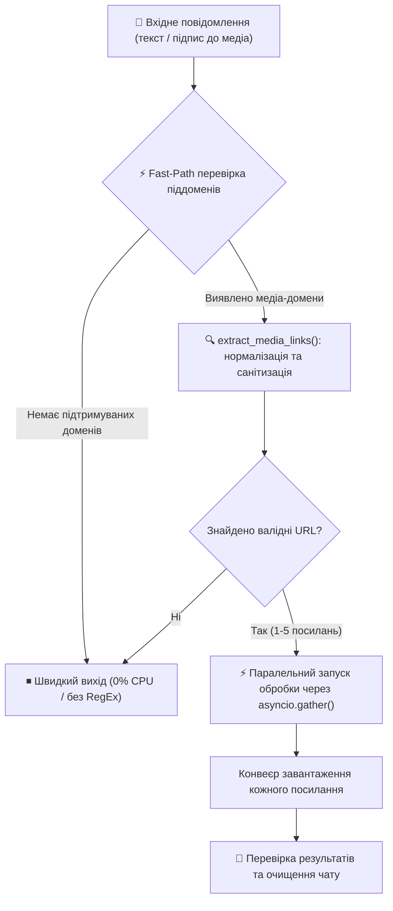
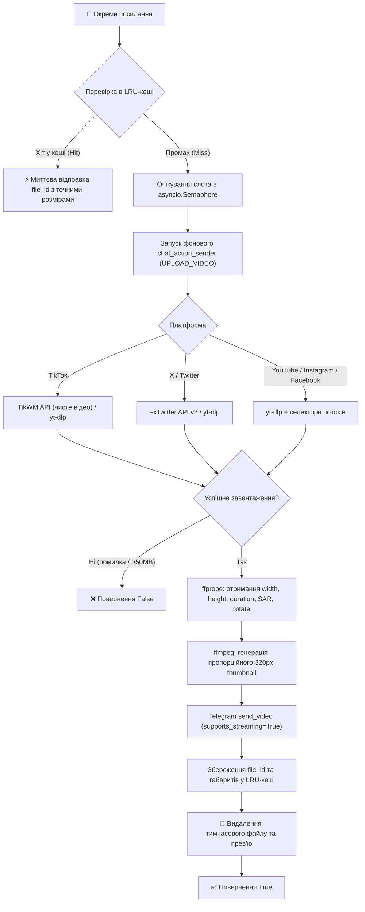
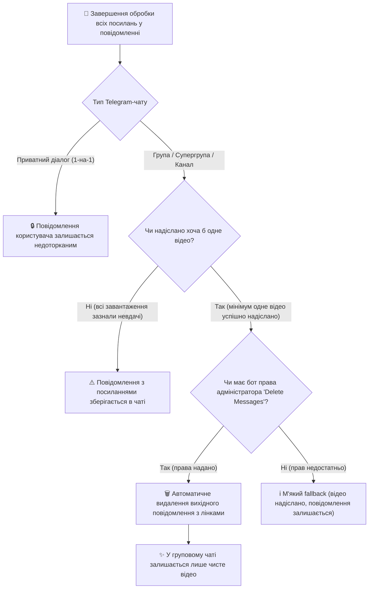
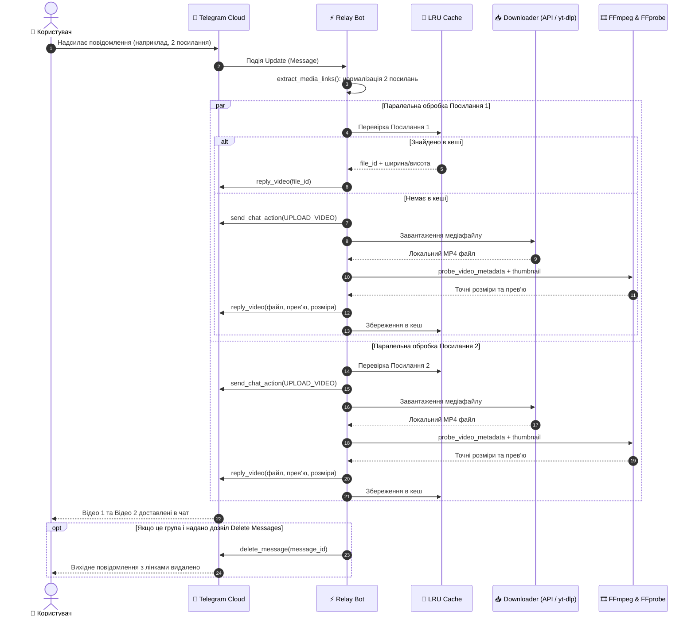
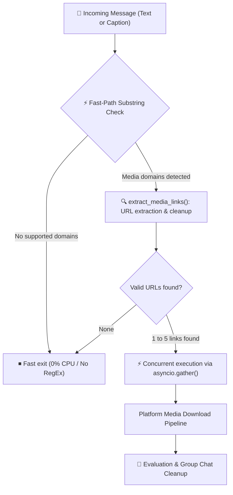
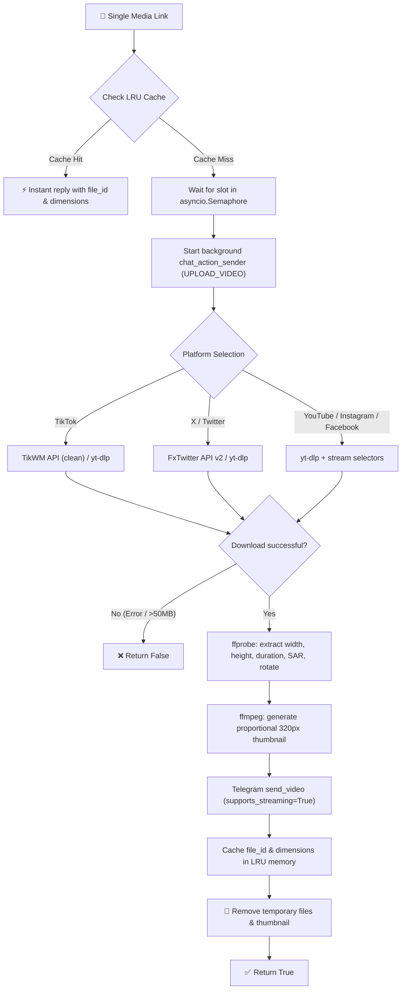
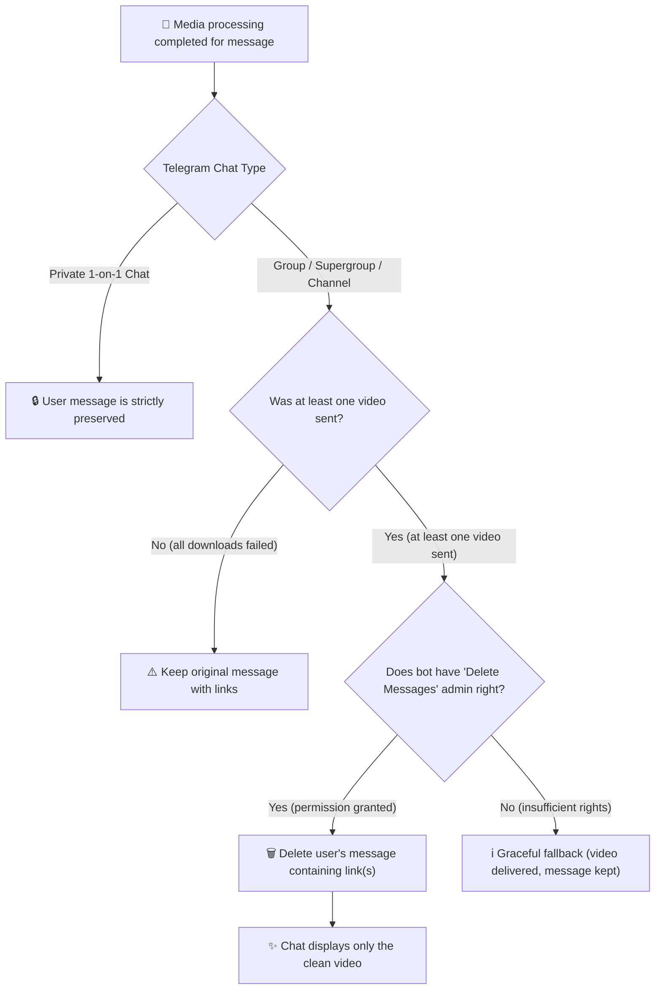
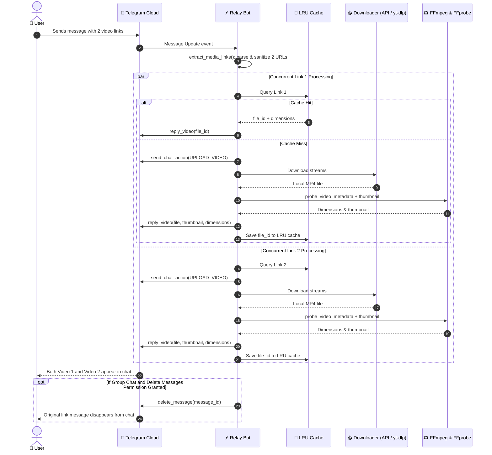

<div align="center">


# ⚡ Relay

**High-Performance Asynchronous Media Interceptor & Downloader for Telegram**  
*Високопродуктивний асинхронний бот для перехоплення та завантаження медіа без втрати якості та звуку*

[](https://github.com/vbazavliuk/Relay/actions/workflows/ci.yml)
[](https://www.python.org/)
[](https://docs.aiogram.dev/)
[](https://www.docker.com/)
[](https://github.com/yt-dlp/yt-dlp)
[](https://ffmpeg.org/)
[](https://opensource.org/licenses/MIT)
[](https://github.com/astral-sh/ruff)

---

### 🌐 Select Language / Оберіть мову
[**🇺🇦 Українська**](#-українська) &nbsp;|&nbsp; [**🇬🇧 English**](#-english)

---

</div>

> [!WARNING]
> **DO NOT RUN LOCALLY ON MACOS. THIS STACK IS HOSTED ON REMOTE LINUX:**
> `valentin@192.168.1.110` in `/opt/stacks/relay/`

<br/>

<a id="-українська"></a>
## 🇺🇦 Українська

**Relay** — це сучасний, мінімалістичний та високопродуктивний Telegram-бот для автоматичного перехоплення посилань і миттєвого завантаження відео в чат безпосередньо з **YouTube (Shorts / Reels / Відео)**, **TikTok**, **Instagram**, **X (Twitter)** та **Facebook**.

Проєкт розроблено з акцентом на **збереження оригінальних пропорцій відео** (вирішення проблеми «квадратних» та сплюснутих роликів у Telegram), **100% гарантію наявності звуку**, **пакетну обробку декількох посилань одночасно** та **розумний стелс-режим для групових чатів**.

---

### ✨ Ключові можливості

* 🚀 **Пакетна обробка посилань (Multi-Link Batch Processing)**: якщо користувач надсилає два або більше посилань поспіль (в одному повідомленні або окремими повідомленнями), бот автоматично розпізнає та паралельно завантажує відео за кожним із них без пропусків.
* 🧹 **Стелс-режим / Очищення групових чатів (Clean Chat Mode)**: у групах та каналах, де боту надано права адміністратора на видалення повідомлень (`Delete Messages`), бот автоматично видаляє вихідне повідомлення з посиланнями після успішної доставки відео. У чаті залишається лише чисте відео без спаму посиланнями. Якщо прав немає — бот спокійно надсилає відео, не ламаючи роботу чату.
* 🔒 **Конфіденційність в особистих повідомленнях**: в особистому діалозі 1-на-1 із ботом повідомлення користувача **ніколи не видаляються**.
* 📐 **Ідеальні пропорції (Aspect Ratio Retention)**: завдяки аналізу метаданих через `ffprobe` (облік SAR та тегів орієнтації камери `rotate` 90°/270°) ролики не стискаються до співвідношення 1:1 та не розтягуються.
* 🔊 **100% гарантія звуку**: зведення роздільних потоків відео (H.264/AVC) та аудіо (AAC) у сумісний контейнер MP4 з прапорцем `+faststart` для моментального перегляду в режимі стримінгу.
* ⚡ **Блискавичний LRU-кеш**: раніше завантажені відео миттєво відправляються іншим користувачам за мілісекунди через Telegram `file_id` без повторного завантаження з інтернету.
* 🛡 **Контроль навантаження**: асинхронний семафор (`asyncio.Semaphore`) обмежує кількість важких завантажень, захищаючи процесор і пам'ять VPS від перевантаження.

---

### 🚀 Підтримувані платформи та формати

| Платформа | Підтримувані формати | Метод завантаження & Особливості |
| :--- | :--- | :--- |
| **▶️ YouTube** | `shorts/...`, `youtu.be/...`, `watch?v=...` | До 1080p, об'єднання відео + аудіо в MP4, фільтрація прямих трансляцій `!is_live` |
| **🎵 TikTok** | `tiktok.com`, `vm.tiktok.com`, `vt.tiktok.com` | Пряме завантаження без водяних знаків (TikWM API) + fallback на `yt-dlp` |
| **📸 Instagram** | `instagram.com/reel/...`, `/reels/...`, `/p/...`, `/tv/...`, share-лінки | Reels, відеопости, IGTV; підтримка сесій через `cookies.txt` |
| **🐦 X (Twitter)** | `x.com/...`, `twitter.com/...`, `fixupx.com/...` | Надшвидкий стрім MP4 через FxTwitter API v2 + резерв через `yt-dlp` |
| **🔷 Facebook** | `facebook.com/reel/...`, `fb.watch/...`, share-лінки | Reels, Watch, публічні відео; автоматичний резолв редиректів коротких посилань |

---

### 📐 Технічний опис: збереження пропорцій та гарантія звуку

#### 1. Усунення «квадратних» та сплюснутих відео
* **ffprobe аналіз**: перед надсиланням бот детально інспектує відеофайл, витягуючи фізичні габарити, Sample Aspect Ratio (SAR) та метадані обертання камери (`rotate` 90°/270° зі смартфонів).
* **Специфікація Telegram API**: у виклику `send_video` бот обов'язково вказує обчислені `width`, `height`, `duration` та прапорець `supports_streaming=True`.
* **Пропорційний thumbnail**: генерується індивідуальне JPEG-прев'ю (довша сторона до 320px), що точно відповідає геометрії відео, позбавляючи Telegram-клієнти від чорних смуг (letterboxing/pillarboxing).

#### 2. Гарантія звуку та миттєвий початок відтворення
* **Автоматичний муксинг потоків**: конфігурація `yt-dlp` пріоритезує відеопотік **H.264 (AVC)** та аудіопотік **AAC (MP4A)**, зводячи їх через `ffmpeg` у єдиний файл MP4.
* **Fast-Start оптимізація**: прапорець `-movflags +faststart` переміщує заголовок `moov` atom на початок файлу, дозволяючи користувачеві дивитися відео одразу під час завантаження в Telegram.

---

### 📊 Графічні схеми архітектури

#### Схема 1: Загальний життєвий цикл повідомлення та фільтрація


#### Схема 2: Конвеєр обробки та завантаження окремого медіа-посилання


#### Схема 3: Матриця рішень: Стелс-видалення посилань у групах


#### Схема 4: Послідовність взаємодії компонентів у часі (Sequence Diagram)


---

### ⚙️ Налаштування оточення (`.env`)

Створіть файл конфігурації `.env` на основі `.env.example`:

```bash
cp .env.example .env
```

| Змінна | Опис | За замовчуванням |
| :--- | :--- | :--- |
| `BOT_TOKEN` | Токен Telegram-бота, отриманий у [@BotFather](https://t.me/BotFather) | *Обов'язково* |
| `MAX_CONCURRENT_DOWNLOADS` | Ліміт одночасних важких завантажень через `yt-dlp` | `3` |
| `COOKIES_FILE` | Шлях до файлу cookies для обходу блокувань Instagram / X | `cookies.txt` |

---

### 📦 Встановлення та запуск

#### Варіант 1: Запуск через Docker Compose (Рекомендовано)

```bash
# Збірка образу та фоновий запуск
docker compose up -d --build

# Перегляд живого журналу логів
docker compose logs -f

# Зупинка контейнера
docker compose down
```

#### Варіант 2: Локальний запуск через Python

```bash
# 1. Створення та активація віртуального середовища
python3 -m venv venv
source venv/bin/activate  # macOS / Linux
# venv\Scripts\activate   # Windows

# 2. Встановлення залежностей
pip install -r requirements.txt

# 3. Запуск бота
python bot.py
```

---

### 💡 Налаштування для груп (BotFather)

#### 1. Увімкнення читання посилань без слеш-команд
За замовчуванням Telegram обмежує видимість повідомлень у групах:
1. Відкрийте [@BotFather](https://t.me/BotFather) і надішліть команду `/mybots`.
2. Оберіть вашого бота → **Bot Settings** → **Group Privacy**.
3. Натисніть **Turn off**.
4. Якщо бот уже був у чаті, видаліть його та додайте знову.

#### 2. Увімкнення режиму чистого чату (Стелс-видалення посилань)
Щоб бот автоматично видаляв повідомлення з посиланнями та залишав тільки чисті відео:
1. Додайте бота до вашої групи як адміністратора.
2. Увімкніть дозвіл **Delete Messages** (Видалення повідомлень).
3. Готово! Тепер при надсиланні посилання бот завантажить відео, надішле його в чат і безслідно видалить вихідне повідомлення з лінком.

---

<br/>

<a id="-english"></a>
## 🇬🇧 English

**Relay** is a state-of-the-art, minimalist, and high-performance Telegram bot engineered for automated link interception and seamless video downloads directly into your chat from **YouTube (Shorts / Reels / Videos)**, **TikTok**, **Instagram**, **X (Twitter)**, and **Facebook**.

Specifically engineered to eliminate the infamous **Telegram square/squished video distortion**, guarantee **100% audio retention**, process **multiple consecutive links concurrently**, and provide **smart stealth cleanup in group chats**.

---

### ✨ Key Features

* 🚀 **Multi-Link Batch Processing**: if a user posts two or more links back-to-back (in a single message or consecutive messages), Relay automatically identifies and processes each link concurrently without skipping any media.
* 🧹 **Clean Chat / Stealth Mode in Groups**: in group chats and channels where Relay is granted administrator privileges with the `Delete Messages` permission, the bot automatically removes the original message containing the links once video delivery succeeds. Only the clean video remains in the chat! If permissions are missing, Relay falls back gracefully and sends the video normally.
* 🔒 **Direct Chat Privacy**: in 1-on-1 private conversations with the bot, user messages are **never deleted**.
* 📐 **Zero Aspect Ratio Distortion**: deep video inspection via `ffprobe` (accounting for Sample Aspect Ratio and smartphone `rotate` 90°/270° orientation tags) guarantees videos are never compressed into 1:1 boxes or stretched unnaturally.
* 🔊 **100% Sound Guarantee**: automatic stream muxing of video (H.264/AVC) and audio (AAC) streams into MP4 containers with `-movflags +faststart` for immediate streaming in Telegram clients.
* ⚡ **Ultra-Fast LRU Memory Cache**: previously downloaded videos are re-sent to any user within milliseconds using cached Telegram `file_id` references, saving bandwidth and VPS CPU.
* 🛡 **Concurrency Throttling**: an asynchronous semaphore (`asyncio.Semaphore`) prevents server overloads by strictly capping simultaneous heavy downloads.

---

### 🚀 Supported Platforms & Formats

| Platform | Supported Formats | Engine & Highlights |
| :--- | :--- | :--- |
| **▶️ YouTube** | `shorts/...`, `youtu.be/...`, `watch?v=...` | Up to 1080p, stream muxing (video + audio in MP4), live stream filter `!is_live` |
| **🎵 TikTok** | `tiktok.com`, `vm.tiktok.com`, `vt.tiktok.com` | Watermark-free downloads via TikWM API + resilient fallback to `yt-dlp` |
| **📸 Instagram** | `instagram.com/reel/...`, `/reels/...`, `/p/...`, `/tv/...`, share links | Reels, posts, IGTV; session auth support via `cookies.txt` |
| **🐦 X (Twitter)** | `x.com/...`, `twitter.com/...`, `fixupx.com/...` | Lightning-fast MP4 stream via FxTwitter API v2 + fallback to `yt-dlp` |
| **🔷 Facebook** | `facebook.com/reel/...`, `fb.watch/...`, share links | Reels, Watch, public videos; automatic short URL unshortening & redirect resolution |

---

### 📐 Technical Deep-Dive: Proportions & Audio Guarantees

#### 1. Eliminating Squished & Letterboxed Videos
* **ffprobe diagnostics**: before transmission, the bot parses video streams for exact pixel dimensions, non-square pixel ratios (SAR), and camera rotation metadata (`rotate` 90°/270° from vertical smartphone captures).
* **Telegram API parameters**: Relay explicitly provides calculated `width`, `height`, `duration`, and `supports_streaming=True` in every upload.
* **Proportional custom thumbnail**: an optimized JPEG thumbnail (longest side capped at 320px) is generated on-the-fly to ensure correct aspect ratios across Telegram Desktop, iOS, and Android.

#### 2. Sound Guarantee & Progressive Playback
* **Automated stream muxing**: the download engine prioritizes **H.264 (AVC)** video with **AAC** audio, remuxing them without quality loss into **MP4** containers.
* **Fast-Start progressive streaming**: `-movflags +faststart` relocates the container metadata (`moov` atom) to the beginning of the file, allowing instant playback without waiting for the full 50MB file to finish downloading.

---

### 📊 Graphic Architecture Diagrams

#### Diagram 1: Message Ingestion & Routing Pipeline


#### Diagram 2: Single Media Link Download Pipeline


#### Diagram 3: Decision Matrix: Stealth Link Cleanup in Group Chats


#### Diagram 4: End-to-End Sequence Diagram


---

### ⚙️ Configuration (`.env`)

Create your `.env` configuration file from the template:

```bash
cp .env.example .env
```

| Variable | Description | Default |
| :--- | :--- | :--- |
| `BOT_TOKEN` | Telegram Bot Token obtained from [@BotFather](https://t.me/BotFather) | *Required* |
| `MAX_CONCURRENT_DOWNLOADS` | Maximum concurrent `yt-dlp` download jobs | `3` |
| `COOKIES_FILE` | Path to cookies file for bypassing platform limits | `cookies.txt` |

---

### 📦 Installation & Quickstart

#### Option 1: Docker Compose (Recommended)

```bash
# Build image and start in background
docker compose up -d --build

# Inspect live logs
docker compose logs -f

# Stop container
docker compose down
```

#### Option 2: Local Python Execution

```bash
# 1. Setup virtual environment
python3 -m venv venv
source venv/bin/activate  # macOS / Linux
# venv\Scripts\activate   # Windows

# 2. Install dependencies
pip install -r requirements.txt

# 3. Start bot
python bot.py
```

---

### 💡 Group Chat Configuration (BotFather)

#### 1. Enabling Automatic Link Reading
By default, Telegram restricts bot visibility in groups:
1. Open [@BotFather](https://t.me/BotFather) and type `/mybots`.
2. Select your bot → **Bot Settings** → **Group Privacy**.
3. Choose **Turn off**.
4. If the bot is already in your group, remove and re-add it.

#### 2. Enabling Clean Chat Mode (Stealth Link Deletion)
To let Relay automatically delete the link message after delivering the video:
1. Promote Relay to **Administrator** in your group.
2. Grant the **Delete Messages** permission.
3. Done! When someone posts a video link, Relay will deliver the video and immediately clean up the link message.

---

### 📄 License

This project is open-sourced under the [MIT License](LICENSE).
